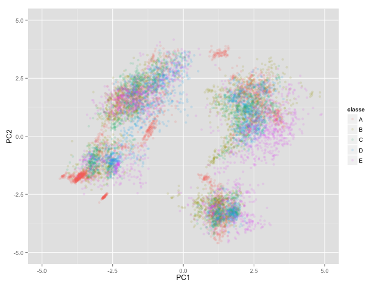
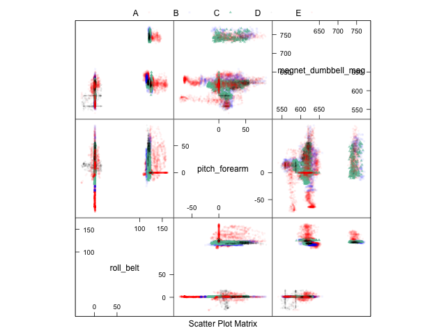
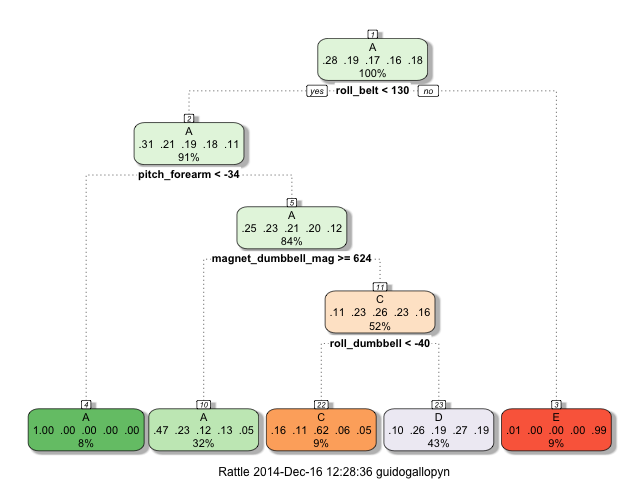

```{r setup, include=FALSE}
#knitr::opts_chunk$set(cache=TRUE)
library(caret)
load("report/report.RData")
```

# Introduction

In this project, our goal is to predict the manner in which subjects perform a weightlifting exercise using data from accelerometers on the belt, forearm, arm, and dumbbell as predictors. We use the Weight Lifting Exercise Data-set that contains data from 6 participants who were asked to perform barbell lifts correctly and incorrectly in 5 different ways. More information is available from the website [here](http://groupware.les.inf.puc-rio.br/har). 

This report describes how the prediction model was build, how we used cross validation, what the estimated out of sample error is, and explains the choices that were made. We have used the prediction model to predict 20 different test cases. 

# Explory Analysis and Data Processing

* the pml-training.csv consists of a set of time series with in total 19622 observations of 160 variables. pml-testing.csv contains only 20 discrete points in time, preventing the prediction model to use features derived from time windows as the authors from the data set [ref 1] did in their prediction modeling. We remove all time related variables. 

* many variables are left blank for a majority of the observations, we remove variables with more than 50% NA observations.

* although some models are robust to this, we remove variables with near zero variance, to reduce the training data size and the training time

* some data from the accellerometers comes in the form of (x,y,z) components of 3D vectors. As covariates we calculate magnitudes of these vectors and we remove the x, y and z components.

* there are some outliers in  magnet\_dumbbell\_mag and gyros\_dumbbell\_mag and gyros\_forearm\_mag variables, each have one observation 50 or more standard deviations from the mean. However we have not removed them, as we plan to use non-model based prediction that is robust against outliers.

* With these pre-processing steps we obtain a data set of 19622 observations of 25 variables

* To train, test and evaluate we partition the data in 3 subsets. We use the training set to train all prediction models, we use the test set for tuning of parameters of the training procedures if needed, and we use the evaluation set to predict the to be expected accuracy. As the final evaluation will be done on discrete time points, we will partition the data with the random partitioning as provided by caret createDataPartition function. Evaluation set is 30% of the data, training set 49% and the test set 21%.  

``` {r, eval=FALSE}
inTrain  <- createDataPartition(y=data$classe, p=0.7, list=FALSE)
training <- data[inTrain,]
evaluation <- data[-inTrain,]
inTrain  <- createDataPartition(y=training$classe, p=0.7, list=FALSE)
testing  <- training[-inTrain,]
training <- training[inTrain,]
```

* Below are 2 characteristic plots of a graphical analysis of predictor variables. The plot shows 2 principle components of the predictor variables with data points colored according to the classe. Observe that classes are not confined to simple regions in this 2D sub-space, and that there are no clear decision boundaries for classification.

``` {r plot1, eval=FALSE}
preProc <- preProcess(training[,-17], method="pca", pcaComp=2)
pcdata <- transform(predict(preProc,training[,-17]),classe=training$classe)
ggplot(pcdata,aes(PC1,PC2)) +  xlim(-5,5) + ylim(-5,5) + geom_point(aes(colour=classe),alpha=0.15,size=2)
```



* The plot below is a caret featurePlot with the predictor variables chosen by a simple classification tree trained on the data, data points are again colored according to the classe. Observe again that there are no obvious decision boundaries between the 5 classes.  

``` {r plot2, eval=FALSE}
cart <- train(classe ~ . , method="rpart",data=training)
featurePlot(x=training[,setdiff(cart$finalModel$frame$var,c("<leaf>"))], y=training$classe, plot="pairs")
```



* In conclusion, the exploratory analysis of training data reveals a complex data set with a high high degree of overlap between the 5 classes A, B, C, D and E, and non-obvious decision boundaries for the classes A, B, C, D and E.

# Model Selection, Training and Cross-validation

The exploratory analysis points to a hard classification problem that will best be tackled by prediction techniques such as classification trees and more advanced statistical classification techniques. We will use the caret package to explore a variety of modeling techniques and in addition build combination of prediction models.

## Simple Classification Tree

As a baseline, we train a classification tree using the training data with the rpart method in the caret train function. We use no pre-processing (not needed for CART) and use default training parameters, which means repeated bootstrapped resampeling (25 reps) with optimal model selection based on accuracy.

``` {r plot3, eval=FALSE}
modFit1 <- train(classe ~ . , method="rpart",data=training)
fancyRpartPlot(modFit1$finalModel)
```


This classification tree scores an accuracy of 48% on the test set. As can be seen, the tree lacks a leaf node to predict class B the sensitivity (recall) of the B class is zero. The purity of the rightmost (red) leaf is great, leading to a positive predictive value (precision) of 99.8% for the E class by using just one simple split on roll-belt. The A class has two leaf nodes resulting from two split criteria on roll belt and pitch-forearm that achieve a recall (sensitivity) of 80%, but only with a precision of 57%. The leaf node for class D is the node where a lot of the data is classified (43%) and with low purity (%). Apparently the rpart training doesn't find a way to further split this node and improve accuracy. With these low accuracy results we have concluded that a simple classification tree will not lead to good results, and we have not explored various training options but instead explored other prediction methods. The full evaluation results are in the appendix.

## More complex classifiers

Given the complexity of the data, we proceed to a four more classifiers on the training set

* a k-nearest neighbor non-parametric model with knn method 
* a bagging with trees model using treebag method
* a random forest model using rf method
* a boosting with trees model with gbm method

For all these training we use no pre-processing and we use caret default parameters which means repeated bootstrapped resampeling (25 reps) with optimal model selection based on accuracy. The training take considerable time (multiple hours of CPU time)

``` {r, eval=FALSE}
modFit0 <- train(classe ~ . , method="knn", data=training)
modFit2 <- train(classe ~ . , method="treebag", data=training)
modFit3 <- train(classe ~ . , method="rf", data=training)
modFit4 <- train(classe ~ . , method="gbm", data=training, verbose=FALSE)
resamps <- resamples(list(KNN = modFit0, TreeBag = modFit2, RF = modFit3, GBM = modFit4))
summary(resamps)
```

``` {r, echo=FALSE}
summary(resamps)
```

The best accuracy measured trough cross validation on the training set is obtained by a Random Forest model, it reaches 97.86% which is comparable to the recognition performance of 98.03% in [ref.1]. The result in [ref.1] was obtained with a classifier constructed as an ensemble of 10 random forests of 10 trees using a bagging method, with predictor variables extracted from an optimal 2.5 sec time windows of the sensors data. The random forest constructed by caret in this project used predictor variables as points in time but contains 500 trees. 

The tree bagging and boosting with threes models give somewhat lower accuracy then the random forest model.

Again surprising is that a simple non-parametric approach as k nearest neighbors is able to reach 82.66 accuracy.

# A Combined Classifier 

As a final step in persuit of even higher accuracy, we build a combined classifier using the models from the previous section, with a random forest to combine the predictions from the test set and provide a final classification. 

```{r model6, eval=FALSE}
pred <- data.frame( pred0 = predict(modFit0,testing),  # prediction of knn model
                    pred2 = predict(modFit2,testing),  # prediction of tree bagging model
                    pred3 = predict(modFit3,testing),  # prediction of random forest model
                    pred4 = predict(modFit4,testing),  # prediction of boosting with trees model
                    classe = testing$classe)
modFit6 <- train(classe ~ . , method="rf", data=pred)
print(modFit6)
```

``` {r print6, echo=FALSE}
print(modFit6)
```

The estimated accuracy of the combined classifier on the test set through cross valistion is 98.8%

On the test set there are only a few places where the final combined model provides a different prediction compared to the random forrest predictor from the previous section.

```{r cm6, eval=FALSE}
confusionMatrix(predict(modFit3,testing),predict(modFit6,pred))$table
```

``` {r cm6p, echo=FALSE}
print(cm6$table)
```

# Final Evaluation and Conclusions

To estimate expected accuracy of the final combined classifier we use the evaluation data set and we compare accuracy with the models explored in this project. We predict outcomes on the evaluation data using the models, and calculate a confusion matrix comparing predicted ourcomes with the evaluation reference, and calculate derived statistics.  

```{r final, eval=FALSE}
pred <- data.frame( pred0 = predict(modFit0,evaluation),  # knn model
                    pred1 = predict(modFit1,evaluation),  # simple tree model
                    pred2 = predict(modFit2,evaluation),  # tree bagging model
                    pred3 = predict(modFit3,evaluation),  # random forest model
                    pred4 = predict(modFit4,evaluation))  # boosting with trees model
pred <- transform(pred,pred6=predict(modFit6,pred),       # prediction of combined model
                  classe=evaluation$classe)               # reference
print(confusionMatrix(pred$pred6,pred$classe))

acc <- data.frame(ModelInfo=sapply(c(0:4,6),function(x) eval(parse(text = paste0("modFit",x,"$modelInfo$label")))),
                  Method=sapply(c(0:4,6),function(x) eval(parse(text = paste0("modFit",x,"$method")))),
                  Accuracy=sapply(paste0("pred",c(0:4,6)), 
                           function(x) confusionMatrix(pred[[x]],pred$classe)$overall[["Accuracy"]]))
print(acc[order(acc$Accuracy),])
```

``` {r acc, echo=FALSE}
print(cm6e)
print(acc[order(acc$Accuracy),])
```

Line number 6 is the accuracy from the final model on the evaluation set, note that it is slighly lower than the random forest model from the previous section, but is well within the 95% confidence interval. 

I found the accuracy obtained surprisingly high, especially that a single large random forest and a also a more complex combined model trained on noisy data taken randomly from time series is able to match the accuracy of the approach in [ref.1]. 

I decided to use the combined model for the submission of the 20 point testing set of this project, because although the accuracy is equivalent as the random forest model, I would hope for slightly more robustness to new data due to a larger number of predictors 

Note: The high accuracy measured here, may be an overestimate due to the artifact of the data set partitioning and cross validation method of resampeling used to measure accuracy on the data set that is a set of time series. Data partitioning and resampeling procedures mix samples from all time series in the data-set, a better way to cross validate may be to hold out complete time series in data partitioning of training, test and evaluation sets and for accuracy measurement on the training set via cross validation. In this way there would be a higher independence of the training, test and evaluation data sets. 

This was not pursued further in this project, as the final model created in this project obtained a perfect 20/20 score on the Coursera submission pages.  

# Appendix

# References
[1] Velloso, E.; Bulling, A.; Gellersen, H.; Ugulino, W.; Fuks, H. Qualitative Activity Recognition of Weight Lifting Exercises. Proceedings of 4th International Conference in Cooperation with SIGCHI (Augmented Human '13) . Stuttgart, Germany: ACM SIGCHI, 2013.
Read more: [http://groupware.les.inf.puc-rio.br/har#ixzz3M5zysvol](http://groupware.les.inf.puc-rio.br/har#ixzz3M5zysvol)

[2] the caret package
[http://topepo.github.io/caret/](http://topepo.github.io/caret/)
